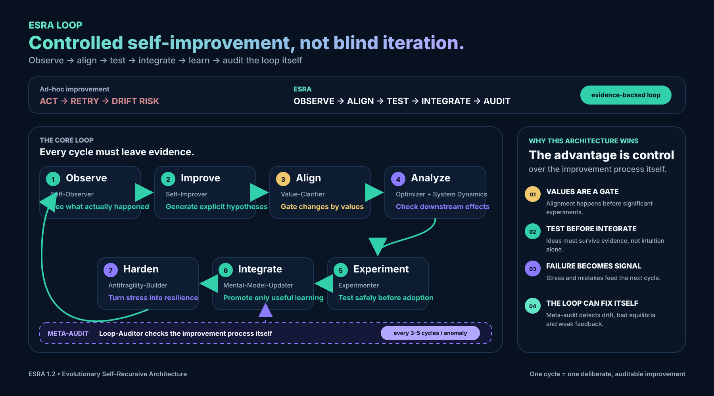

# ESRA Agents — Universal ESRA Implementation

[](https://github.com/rrpauls/esra-agents/actions/workflows/validate.yml)
[](LICENSE)
[](https://github.com/rrpauls/esra/blob/main/docs/ESRA_Technical_Specification.md)
[](https://github.com/rrpauls/esra-agents/releases/tag/v0.2.2)

<p align="center">
  <picture>
    <source media="(prefers-color-scheme: dark)" srcset="assets/logo-inverse.svg">
    <source media="(prefers-color-scheme: light)" srcset="assets/logo.svg">
    
  </picture>
</p>

<p align="center">
  <strong>The canonical cross-host implementation of ESRA 1.2</strong>
</p>

<p align="center">
  Portable skills, evidence records, bounded experiments, audits, export, and guarded evolutionary self-correction.
</p>

<p align="center">
  <a href="docs/ARCHITECTURE.md">Architecture</a> ·
  <a href="docs/RUNTIME.md">Runtime</a> ·
  <a href="INSTALL.md">Installation</a> ·
  <a href="docs/AUTONOMOUS_ROADMAP.md">Autonomous roadmap</a> ·
  <a href="docs/AUTONOMOUS_HOST_GATE.md">Host gate</a> ·
  <a href="https://github.com/rrpauls/esra">ESRA specification</a> ·
  <a href="LICENSE">Apache-2.0 License</a>
</p>

---

## What is ESRA Agents?

ESRA Agents is the canonical implementation source for five selective ESRA
skills, a dependency-free shared runtime, portable evidence export, and thin
host adapters for chat-scoped and autonomous agents.

It implements the runtime-neutral contracts defined by the
[ESRA specification](https://github.com/rrpauls/esra) while keeping host names,
paths, lifecycle mappings, permissions, and installation mechanics outside the
portable core.

Routine work bypasses ESRA. Focused skills work independently, and a major
change may receive at most one bounded review.

## Current status

- **Specification target:** ESRA 1.2.
- **Portable core:** five selective Agent Skills, evidence records, bounded
  experiments, audits, and export.
- **Autonomous controller:** exact-revision promotion, one-time authorization,
  blind evaluation, canary rollout, rollback, and privacy-bounded persistence.
- **Native adapters:** OpenClaw TypeScript adapter at
  [`v0.2.2` prerelease](https://github.com/rrpauls/esra-agents/releases/tag/v0.2.2)
  and Hermes Python plugin at v0.3.0.
- **Maturity boundary:** stable autonomous capability remains gated by the
  shared host gate and seven-day soak. Package validation and passing tests do
  not by themselves prove native lifecycle behavior in every host.

See the [autonomous roadmap](docs/AUTONOMOUS_ROADMAP.md),
[host-gate evidence](docs/AUTONOMOUS_HOST_GATE.md), and normative
[Autonomous Agent Profile](https://github.com/rrpauls/esra/blob/main/docs/ESRA_Autonomous_Agent_Profile.md)
for the exact claim boundaries.

---

## Core components

| Component | Purpose |
|-----------|---------|
| [`skills/`](skills/) | Five host-neutral, selectively invoked ESRA skills |
| [`runtime/`](runtime/) | Shared runtime, portable exporter, lifecycle hook, and guarded autonomous controller |
| [`adapters/`](adapters/) | Thin host integrations for OpenAI clients, Claude Code, OpenClaw, and Hermes Agent |
| [`docs/ARCHITECTURE.md`](docs/ARCHITECTURE.md) | Portability boundary, controller policy boundary, and persistence model |
| [`docs/RUNTIME.md`](docs/RUNTIME.md) | Runtime, export, and autonomous-controller commands |
| [`INSTALL.md`](INSTALL.md) | Reproducible installation instructions by host |
| [`esra-conformance.json`](esra-conformance.json) | Machine-readable implementation capability declaration |

## Supported hosts

| Host | Integration | Distribution boundary |
|------|-------------|-----------------------|
| OpenClaw | Native TypeScript lifecycle adapter and Skill Workshop promotion gate | v0.2.2 prerelease |
| Hermes Agent | Native Python plugin and isolated `skill_manage` flow | v0.3.0 package |
| ChatGPT / Codex | Agent Plugins 1.0 package with portable skills | Local marketplace distribution |
| Claude Code | Plugin manifest, portable skills, and lifecycle mapping | Claude plugin distribution |

Web-only clients receive the portable guidance available to them, not local
Python hooks or filesystem persistence. Use a tagged release and verify
`SHA256SUMS` before installation. Full commands are in
[Installation](INSTALL.md).

---

## Autonomous loop



The autonomous profile implements:

`observation → trigger → proposal → alignment → experiment → blind evaluation → local promotion → canary/rollback`

Guarded mode can promote only an exact evaluated revision of a local,
agent-owned, text-only skill. ESRA core, controller and evaluator code, values,
safety rules, credentials, runtime code, host configuration, and canonical
repository content remain human-approved proposals.

Hooks persist only allowlisted metadata and hashes. Prompts, transcripts, tool
arguments and results, secrets, and raw run identifiers are excluded.

## Design principles

- **One portable core** — every supported host uses the same open Agent Skills tree.
- **Thin adapters** — host-specific manifests, event mappings, paths, and installers stay outside the core.
- **Selective invocation** — routine work bypasses ESRA and focused skills operate independently.
- **Evidence before promotion** — experiments require explicit alignment, evaluation, authorization, and rollback.
- **Privacy by construction** — lifecycle hooks retain only allowlisted metadata and hashes.
- **Bounded autonomy** — protected surfaces remain human-approved and native mutation uses a separate authorized identity.

---

## How to use this repository

1. Read [Architecture](docs/ARCHITECTURE.md) for the portable-core and host-adapter boundary.
2. Choose a host and follow [Installation](INSTALL.md) using a tagged release.
3. Use the focused skill that matches the task; do not load the full catalog for routine work.
4. Use [Runtime commands](docs/RUNTIME.md) for evidence export or guarded controller operations.
5. Complete the [host gate](docs/AUTONOMOUS_HOST_GATE.md) before making native autonomous-capability claims.

## Development

Run the repository checks from the project root:

```bash
python3 scripts/validate_skills.py
python3 scripts/validate_plugin.py
python3 -m unittest discover -s tests -v
python3 scripts/build_distributions.py
python3 scripts/validate_distributions.py
```

## Relationship to ESRA

The [`esra`](https://github.com/rrpauls/esra) repository defines **what** the
architecture is: its specification, data contracts, conformance tests, and
host-pilot gates.

This repository defines the canonical cross-host implementation: portable
skills and runtime behavior with thin host adapters.

Earlier host-specific repositories remain available during migration and retain
their existing release URLs:

- **[hermes-esra](https://github.com/rrpauls/hermes-esra)** — legacy Hermes skills and integration toolkit
- **[chatgpt-esra](https://github.com/rrpauls/chatgpt-esra)** — legacy OpenAI distribution for ChatGPT and Codex
- **[claude-esra](https://github.com/rrpauls/claude-esra)** — legacy Claude Code distribution

## License

Apache-2.0 — see [LICENSE](LICENSE). Attribution and trademark separation are
recorded in [NOTICE](NOTICE).

---

**ESRA Agents is a living implementation.**
It evolves together with the ESRA specification and its host evidence.
